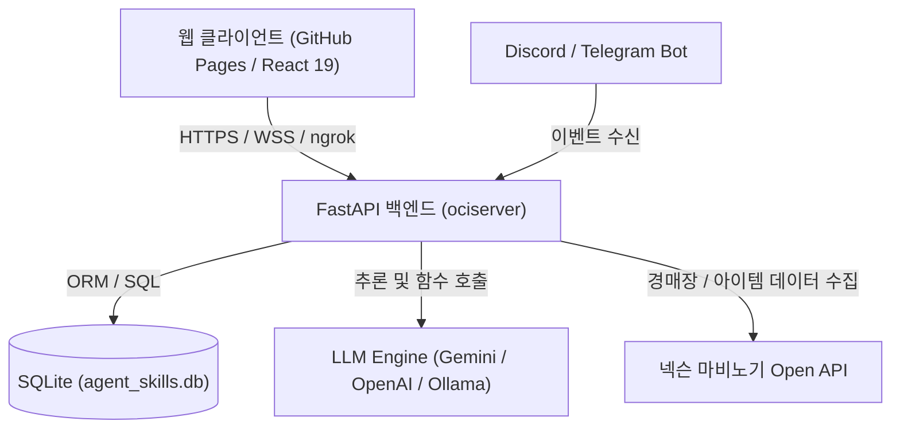

# 🌐 AI Voice Agent & Mabinogi Archive 종합 가이드

> **통합 AI 어시스턴트 & 마비노기 데이터 아카이브 플랫폼**  
> AI 챗봇 에이전트(음성/텍스트/3D 아바타), 마비노기 공식 Open API 데이터 수집·정형화·분석 아카이브, 실시간 태스크 모니터링 및 스킬 공방 시스템을 포괄하는 풀스택 프로젝트입니다.

---

## 📑 목차
1. [프로젝트 개요 및 핵심 구상](#1-프로젝트-개요-및-핵심-구상)
2. [전체 시스템 아키텍처](#2-전체-시스템-아키텍처)
3. [디렉토리 및 컴포넌트 구조](#3-디렉토리-및-컴포넌트-구조)
4. [프론트엔드 (blog) 상세 가이드](#4-프론트엔드-blog-상세-가이드)
5. [백엔드 (ociserver) & 마비노기 아카이브 가이드](#5-백엔드-ociserver--마비노기-아카이브-가이드)
6. [설치 및 로컬 실행 방법](#6-설치-및-로컬-실행-방법)
7. [GitHub Pages 배포 및 이슈 해결 가이드 (Troubleshooting)](#7-github-pages-배포-및-이슈-해결-가이드-troubleshooting)
8. [기능 확장 및 유지보수 규칙](#8-기능-확장-및-유지보수-규칙)

---

## 1. 프로젝트 개요 및 핵심 구상

본 프로젝트는 독립적으로 동작하는 **지능형 AI 페어 프로그래밍/어시스턴트**와 **마비노기 공식 경매장/아이템/인챈트 빅데이터 아카이브**를 하나의 웹 인터페이스에서 유기적으로 제공하는 것을 목표로 합니다.

### 🌟 주요 핵심 기능
- 🤖 **AI 음성/텍스트 어시스턴트**: Web Speech API(음성 인식 및 TTS)와 LLM을 결합한 지능형 비서
- 👤 **3D VRM 인터랙티브 아바타**: Three.js 기반 립싱크, 시선 추적 및 표정 애니메이션
- ⚔️ **마비노기 아카이브 (`/blog/mabinogi`)**:
  - 넥슨 Open API 연동 실시간 경매장 데이터 수집
  - 세공 옵션, 인챈트(접두/접미), 개조 능력치 정규화 및 Min~Max 집계
  - 가중 평균 거래가(`avg_price`) 및 최근 거래가(`recent_price`) 실시간 산출
- 📊 **실시간 대시보드 (`monitor`) & 처리 내역 (`history`)**: 백그라운드 태스크 진행 상태 및 로그 모니터링, 태스크 강제 취소
- 🛠️ **스킬 공방 (`workshop`)**: 동적 파이썬 스킬 생성, 테스트 및 외부 스킬 임포트
- 🔑 **계정 및 Open API Key 관리 (`credentials`)**: Google OAuth, Nexon Open API Key 등 안전한 암호화 저장

---

## 2. 전체 시스템 아키텍처



---

## 3. 디렉토리 및 컴포넌트 구조

```
e:\workspace\AIagent\
├── blog/                         # 프론트엔드 (React 19 + Vite + SPA)
│   ├── .github/workflows/       # GitHub Pages 배포 자동화 액션 (deploy-frontend.yml)
│   ├── public/                  # 정적 리소스
│   ├── src/
│   │   ├── components/
│   │   │   ├── VoiceAssistant.jsx    # 메인 포털 & 탭 스위처
│   │   │   ├── AvatarCanvas.jsx      # 3D VRM 아바타 렌더러
│   │   │   ├── RealtimeMonitor.jsx   # 실시간 태스크 모니터링 대시보드
│   │   │   ├── ExecutionHistory.jsx  # 태스크 실행 이력 조회
│   │   │   ├── SkillWorkshop.jsx     # 스킬 공방 컴포넌트
│   │   │   ├── CredentialsManager.jsx# API 키 및 계정 관리자
│   │   │   └── AgentChat.jsx         # 음성/채팅 패널
│   │   ├── App.jsx              # 루트 레이아웃 & 배경 효과
│   │   ├── main.jsx             # 진입점
│   │   └── index.css            # 글로벌 디자인 시스템 및 글래스모피즘 테마
│   ├── vite.config.js           # Vite 빌드 설정 (base: '/blog/')
│   └── package.json
│
├── ociserver/                    # 백엔드 (Python FastAPI + Agent Engine)
│   ├── app.py / api_server.py   # FastAPI 서버 엔드포인트 및 ngrok 터널링
│   ├── agent_brain.py           # LLM 오케스트레이션 및 스킬 실행 엔진
│   ├── db.py                    # 데이터베이스 모델 정의 (SQLAlchemy/SQLite)
│   ├── cli.py / agentCli/       # CLI 제어 센터
│   ├── discord_bot.py           # 디스코드 연동 봇
│   ├── telegram_bot.py          # 텔레그램 연동 봇
│   ├── migrate_new_plan.py      # 마비노기 아카이브 신규 스키마 마이그레이션
│   ├── backfill_all_prices.py   # 거래가 가중평균 및 최근가 보정 스크립트
│   └── 데이터 수집 가이드.md    # 데이터 추출/정규화 상세 명세
│
├── RadDollV3_v3.02/             # 3D 캐릭터 VRM 에셋 모델
└── spark/                       # 대용량 데이터 처리 스크립트
```

---

## 4. 프론트엔드 (blog) 상세 가이드

### 4.1 탭 구성 및 URL 라우팅
`VoiceAssistant.jsx`는 URL 경로, 해시, 쿼리스트링을 감지하여 초기 탭을 자동으로 설정합니다 (`getInitialTab` 함수):

| 탭 식별자 | 명칭 | 주요 기능 | 지원 URL 경로 예시 |
| :--- | :--- | :--- | :--- |
| `agent` | 🤖 에이전트 | AI 음성 대화, 3D 아바타, 텍스트 채팅, 시스템 상태 | `/blog/` |
| `archives` | ⚔️ 마비노기 | 아이템 및 인챈트 아카이브, 세공/개조 옵션, 가격 통계 | `/blog/mabinogi`, `?tab=mabinogi` |
| `monitor` | 📊 대시보드 | 진행 중인 태스크 모니터링, 실시간 로그 스트림, 태스크 중단 | `/blog/monitor`, `?tab=dashboard` |
| `workshop` | 🛠️ 스킬 공방 | 에이전트 스킬 생성, 편집, 실행 테스트, 외부 스킬 가져오기 | `/blog/workshop` |
| `credentials` | 🔑 계정 / API Key | 넥슨 Open API Key 등록, Google 계정 연동, 비밀키 관리 | `/blog/credentials` |
| `history` | ⏱️ 처리 내역 | 실행 완료/실패/중단 태스크 이력 필터링 및 상세 조회 | `/blog/history` |

### 4.2 주요 컴포넌트 연동 주의사항
- **`RealtimeMonitor.jsx` & `ExecutionHistory.jsx`**:
  - `VoiceAssistant.jsx` 상단에 반드시 `Activity`, `History` 아이콘이 `lucide-react`에서 import되어야 합니다.
  - `monitorTasks`, `monitorLogs`, `fetchMonitorData`, `handleCancelTask` 상태 및 콜백 함수와 바인딩되어 동작합니다.

---

## 5. 백엔드 (ociserver) & 마비노기 아카이브 가이드

### 5.1 마비노기 데이터 아카이브 파이프라인
1. **경매장 데이터 수집**: 넥슨 Open API (`/mabinogi/v1/auction/list`) 호출
2. **세공 옵션 정형화**: `[효과] ([레벨]:[수치] [증감])` 구조로 그룹핑하여 `stats_min_max_json` 및 `grouped_options_json` 저장
3. **인챈트 분리 추출**: 장비에 적용된 접두/접미 인챈트를 독립적인 `MabiEnchantArchive` 레코드로 자동 생성
4. **가격 정량화**:
   - `avg_price`: 샘플 수(`sample_count`) 기반 가중 평균 가격 실시간 누적 산출
   - `recent_price`: 가장 최근 수집된 유효 거래가로 갱신

---

## 6. 설치 및 로컬 실행 방법

### 6.1 프론트엔드 실행
```powershell
# 1. blog 폴더로 이동
cd e:\workspace\AIagent\blog

# 2. 의존성 설치 (최초 1회)
npm install

# 3. 개발 서버 실행 (기본 포트: 5173)
npm run dev
```

### 6.2 백엔드 실행
```powershell
# 1. ociserver 폴더로 이동
cd e:\workspace\AIagent\ociserver

# 2. 파이썬 의존성 설치
pip install -r requirements.txt   # 또는 fastapi uvicorn sqlalchemy requests

# 3. API 서버 실행 (기본 포트: 8000)
python app.py
```

---

## 7. GitHub Pages 배포 및 이슈 해결 가이드 (Troubleshooting)

### 7.1 화면 백지화 (Blank Screen) 방지 규칙
- **Vite Base Path (`vite.config.js`)**:
  - GitHub Pages 저장소 이름(`/blog/`)에 맞추어 반드시 **`base: '/blog/'`**로 설정되어야 합니다.
  - `base: './'`로 설정 시 하위 경로(`/blog/mabinogi`) 직접 접속 시 에셋 404가 발생합니다.
- **SPA 라우팅 404 대응**:
  - `.github/workflows/deploy-frontend.yml`에서 빌드 후 `dist/index.html`을 `dist/404.html`로 복사하여 GitHub Pages가 모든 서브 경로를 `index.html`로 라우팅하도록 구성해야 합니다.
- **아이콘 및 모듈 Import 누락 확인**:
  - JSX에서 사용하는 `lucide-react` 아이콘은 반드시 파일 상단 `import`문에 누락 없이 선언되어야 브라우저 런타임 Crash가 발생하지 않습니다.

### 7.2 GitHub Pages 배포 명령어
```powershell
cd e:\workspace\AIagent\blog
git add .
git commit -m "fix: update frontend components and deployment configuration"
git push origin main
```

---

## 8. 기능 확장 및 유지보수 규칙

1. **신규 탭 추가 시**:
   - `VoiceAssistant.jsx` 상단 탭 버튼 목록에 버튼 추가
   - `getInitialTab` 함수에 URL 라우트 감지 조건 추가
   - 본문 조건부 렌더링 삼항 연산자 블록(`activeTab === 'newTab' ? ... : ...`)에 컴포넌트 연결
2. **마비노기 DB 스키마 수정 시**:
   - `ociserver/db.py` 모델 클래스 수정 후 `migrate_new_plan.py`를 실행하여 데이터 정합성 유지
   - 가격 데이터 추가 보정 시 `backfill_all_prices.py` 실행
